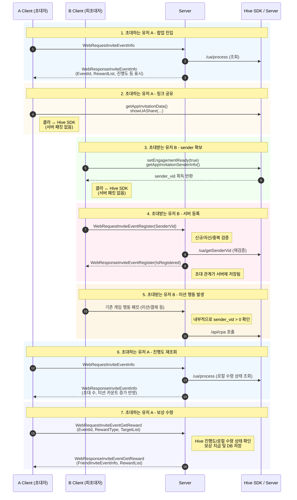

# Friend Invite Event Sequence Diagram

초대 이벤트의 전체 흐름을 Mermaid 시퀀스 다이어그램으로 정리한 문서입니다.

## Step Summary

1. 초대자 A가 이벤트 팝업에 진입하면 서버가 Hive 조회 결과를 포함한 이벤트 정보를 반환합니다.
2. 초대자 A는 Hive SDK를 통해 초대 링크를 생성하고 공유합니다.
3. 피초대자 B는 Hive SDK에서 `sender_vid`를 확보합니다.
4. 피초대자 B는 `SenderVid`를 서버에 등록하고, 서버는 Hive를 통해 재검증 후 초대 관계를 저장합니다.
5. 피초대자 B의 미션 행동이 발생하면 서버가 내부 검증 후 Hive `CPA`를 호출합니다.
6. 초대자 A가 진행도를 재조회하면 누적 초대 수와 미션 카운트가 반영된 결과를 받습니다.
7. 초대자 A가 보상 수령을 요청하면 서버가 진행도와 수령 상태를 확인한 뒤 보상을 지급합니다.
